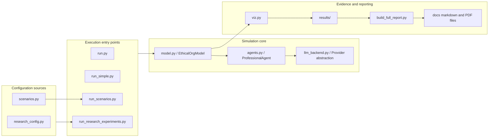
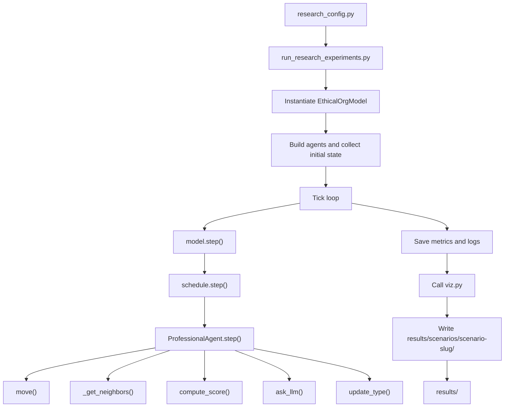
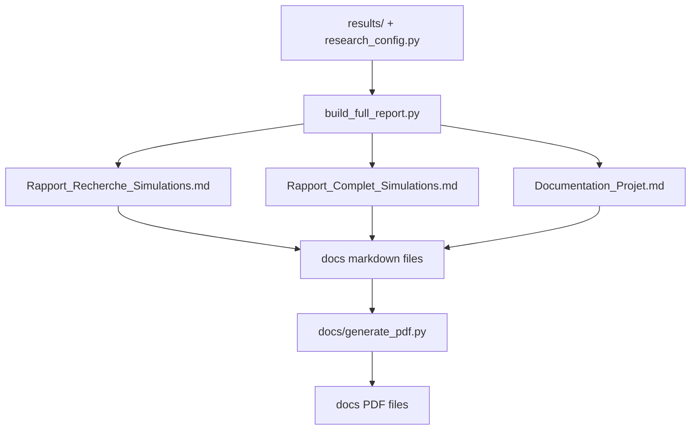
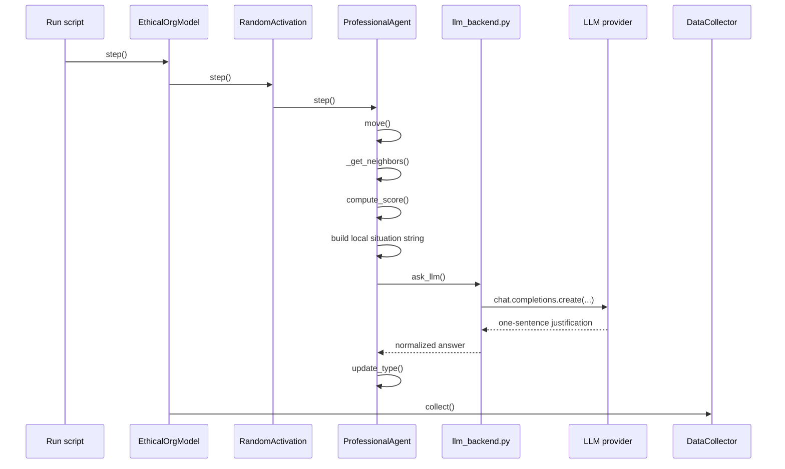

# Code Architecture and Functional Interaction Map

## 1. Executive Summary

This document explains how the codebase is organized, how the main functions interact, and how runtime information moves from scenario configuration to simulation outputs and research documents. The architecture follows a clear separation between:

- simulation core;
- LLM adapter layer;
- orchestration scripts;
- visualization and reporting;
- documentation and publication tooling.

## 2. Module Dependency Structure

## 3. Architectural Responsibilities

| File | Primary responsibility | Main downstream effects |
|---|---|---|
| `model.py` | Defines the Mesa model, population, scheduler, and data collection | Drives the runtime state of the simulation |
| `agents.py` | Defines agent behavior, movement, scoring, prompt construction, and state updates | Produces decisions and local transitions |
| `llm_backend.py` | Encapsulates LLM-provider access | Keeps the rest of the codebase provider-agnostic |
| `research_config.py` | Declares structural experiments and hypotheses | Controls reproducible scenario campaigns |
| `scenarios.py` | Stores generic dilemma prompts | Supports exploratory or non-campaign runs |
| `viz.py` | Renders grids, metrics, comparisons, and conversation snapshots | Produces publication-ready figures |
| `run_research_experiments.py` | Orchestrates the full scenario campaign | Produces the research evidence bundle |
| `build_full_report.py` | Converts result artifacts into research narratives | Produces Markdown reports |

## 4. End-to-End Execution Flow

### 4.1 Full Research Campaign

### 4.2 Documentation Pipeline

## 5. Functional Interaction Detail

### 5.1 `EthicalOrgModel`

| Function | Called by | Calls | Output |
|---|---|---|---|
| `__init__` | Run scripts | `build_agent_types`, Mesa grid/scheduler setup | A configured simulation instance |
| `step` | Run scripts, Mesa server | `_print_state_snapshot`, `schedule.step`, data collector | One full model observation |
| `summary` | Run scripts | `datacollector.get_model_vars_dataframe` | Final metrics dataframe |

### 5.2 `ProfessionalAgent`

| Function | Role | Key dependencies |
|---|---|---|
| `move` | Relocates the agent on the grid | Mesa neighborhood utilities |
| `_get_neighbors` | Retrieves local social context | Grid, role-specific radius |
| `compute_score` | Produces the local ethical tendency score | Neighbor influence, `alpha`, `beta`, `gamma` |
| `ask_llm` | Requests a one-sentence justification | `llm_backend.py` |
| `update_type` | Converts score and text into a state change | Threshold logic, linguistic parsing |
| `step` | Full agent pipeline | All functions above |

### 5.3 `llm_backend.py`

This module is deliberately narrow. Its design goal is to ensure that provider changes do not spread across the simulation code.

| Function | Responsibility |
|---|---|
| `get_llm_provider` | Reads the provider preference |
| `get_llm_api_key` | Retrieves the generic or provider-specific API key |
| `get_llm_model_name` | Reads the configured model identifier |
| `get_llm_base_url` | Supports OpenAI-compatible custom endpoints |
| `resolve_model_name` | Normalizes provider/model naming |
| `create_llm_client` | Exposes a chat-completions interface to the rest of the code |

## 6. Single-Tick Interaction Sequence

## 7. Artifact Lifecycle

### 7.1 Runtime Artifacts

- `metrics.csv` stores per-observation counts and ratios.
- `conversation_log.txt` stores the full textual trace of a scenario.
- `interpretation.txt` stores a synthetic scenario reading.
- `grid_*.png`, `metrics.png`, and `conversation_snapshot.png` store visual evidence.

### 7.2 Documentation Artifacts

- `build_full_report.py` transforms raw outputs into structured Markdown.
- `docs/generate_pdf.py` renders the documentation set into PDF with Mermaid diagrams.

## 8. Extension Points

The codebase was intentionally organized so that future contributors can extend one layer without rewriting the others.

### 8.1 To add a new provider

Change `llm_backend.py` only, unless the new provider requires new prompt semantics.

### 8.2 To add a new structural scenario

Edit `research_config.py` and rerun `run_research_experiments.py`.

### 8.3 To add new figures

Extend `viz.py` and wire the new outputs into the reporting scripts.

### 8.4 To change the publication package

Adjust `build_full_report.py`, `docs/generate_pdf.py`, and the hand-written documents in `docs/`.

## 9. Architectural Invariants

The following invariants should remain stable:

1. The LLM layer must stay an explanatory layer, not the owner of the transition logic.
2. Scenario definitions should remain centralized in configuration rather than duplicated across scripts.
3. Generated artifacts must remain outside version control and reproducible from source.
4. Visualization and reporting must consume saved artifacts rather than hidden in-memory state whenever possible.
