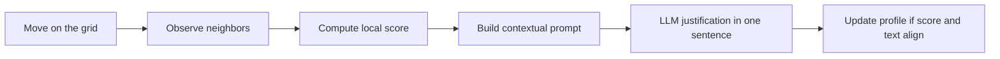
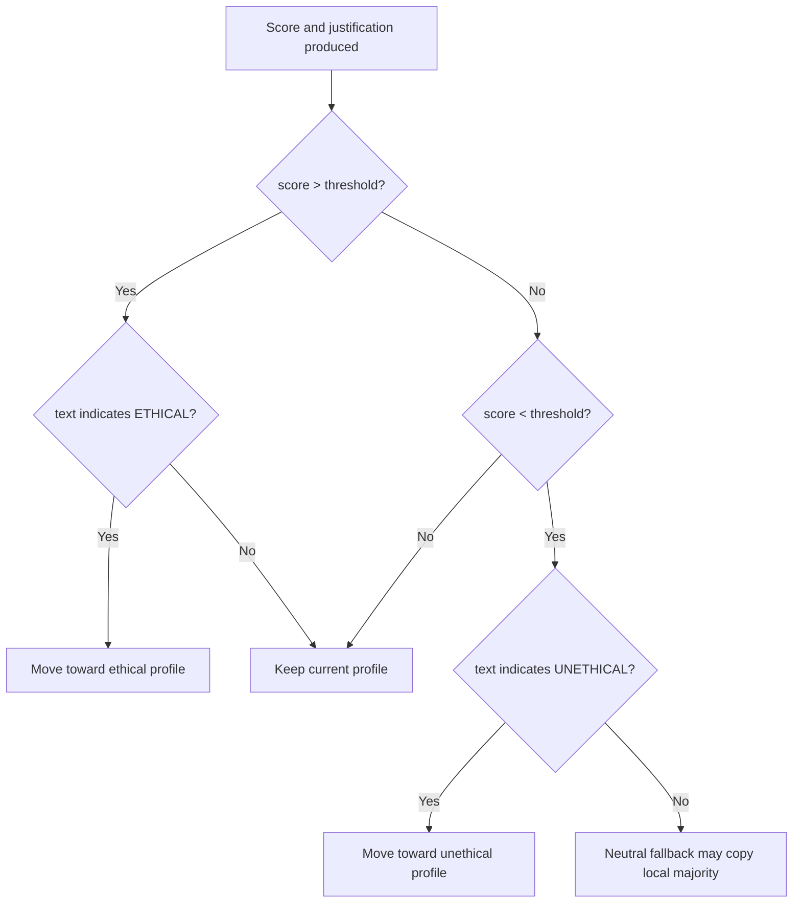
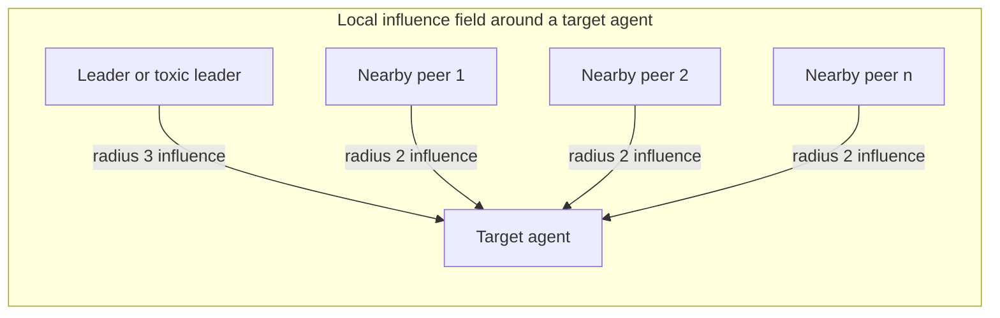

# ODD Protocol and Agent Interaction Architecture

## Abstract

This document formalizes the organizational ethics simulation according to the ODD protocol while making the agent interaction logic explicit. The model combines an agent-based simulation implemented with Mesa and a provider-agnostic LLM layer used to generate short decision justifications. Its purpose is not only to track behavioral transitions but also to document the local rationales that accompany ethical or unethical conduct inside a technology organization.

## 1. Purpose and Research Scope

### 1.1 Scientific Objective

The model studies how ethical cultures emerge, stabilize, or degrade under the combined effect of:

- local peer influence;
- institutional strength;
- economic pressure;
- exemplary or toxic leadership.

The research contribution lies in the articulation between quantitative state transitions and qualitative justifications. The model therefore addresses two questions at once:

1. Under which structural conditions does an ethical majority remain stable?
2. What forms of reasoning accompany conformity, resistance, drift, or opportunism?

### 1.2 Core Hypothesis

Ethical behavior is not treated as a fixed personal trait. It is modeled as a situated outcome that depends on the local social field, organizational constraints, and contextual pressure.

## 2. Entities, State Variables, and Scales

### 2.1 Agent Types

Each `ProfessionalAgent` represents a professional embedded in the organization.

| Agent type | Strategic role | Typical effect on the local field |
|---|---|---|
| `ethical` | Norm-preserving employee | Reinforces compliant behavior |
| `non_ethical` | Opportunistic employee | Reinforces deviant behavior |
| `neutral` | Undecided employee | Most sensitive to local contagion |
| `leader` | Ethical authority figure | Broadcasts stabilizing influence |
| `toxic_leader` | Corrupt authority figure | Broadcasts fear, impunity, and drift |

### 2.2 Agent State Variables

| Variable | Type | Description |
|---|---|---|
| `agent_type` | `str` | Current behavioral profile |
| `influence_level` | `float` | Social weight exerted on neighbors |
| `social_sensitivity` | `float` | Degree of receptivity to the local social climate |
| `pos` | `tuple[int, int]` | Position on the toroidal grid |
| `score_history` | `list[float]` | Archived local decision scores |
| `decision_history` | `list[str]` | Archived LLM-generated justifications |

### 2.3 Environment

The environment is a toroidal `MultiGrid`. Standard agents interact within radius 2. Leaders and toxic leaders interact within radius 3 to represent wider managerial reach.

### 2.4 Model-Level Parameters

| Parameter | Meaning | Typical range |
|---|---|---|
| `n_agents` | Population size | 15 to 60 in current scripts |
| `institution_strength` | Strength of formal norms | 0.0 to 1.0 |
| `resource_pressure` | Economic or operational stress | 0.0 to 1.0 |
| `threshold` | Transition threshold | 0.4 to 0.5 |
| `alpha` | Weight of peer influence | 0.0 to 1.0 |
| `beta` | Weight of institutional strength | 0.0 to 1.0 |
| `gamma` | Weight of pressure | 0.0 to 1.0 |
| `dynamic_pressure` | Whether pressure rises over time | `True` or `False` |
| `leader_type` | Nature of the leadership pole | `leader` or `toxic_leader` |

## 3. Process Overview and Scheduling

At each tick, every agent executes a local cycle composed of movement, observation, evaluation, justification, and possible type transition.



The scheduler is `RandomActivation`, which means the execution order varies at each tick and preserves stochasticity at the collective level.

## 4. Design Concepts

### 4.1 Emergence

Organizational culture is not imposed globally. It emerges from repeated local interactions, the distribution of leader types, and structural pressures.

### 4.2 Adaptation

Neutral agents are intentionally the most adaptive. They function as a transmission medium through which local climates become macro-level patterns.

### 4.3 Sensing

Agents do not read the full system state. They observe only their neighborhood, plus global contextual cues injected into the prompt:

- resource pressure;
- institutional strength;
- current local score;
- current dilemma.

### 4.4 Stochasticity

Stochasticity enters the system through:

- random initial placement;
- random movement;
- randomized activation order;
- Gaussian noise applied to the effective decision score;
- non-deterministic LLM outputs.

### 4.5 Observation

The model records one initial observation and one observation after each tick. This allows direct comparison between initial conditions and the full temporal trajectory.

## 5. Initialization

The baseline population mix is:

- 35% `ethical`;
- 30% `non_ethical`;
- 25% `neutral`;
- 10% leadership profile.

Any remainder created by integer rounding is redistributed automatically so that the final population matches exactly the requested number of agents.

## 6. Input Data

Two input sources drive the simulation logic:

### 6.1 Structural Experiments

`research_config.py` centralizes the four research scenarios:

- The Culture of Fear;
- The Ethical Fortress;
- The Effect of Economic Pressure;
- The Impact of Social Influence.

Each scenario defines a title, a hypothesis, an interpretive hint, and a configuration dictionary.

### 6.2 Dilemma Text

Agents receive either:

- a fixed dilemma from the active research scenario; or
- a random dilemma from `scenarios.py` for exploratory runs.

## 7. Submodels

### 7.1 Movement

Movement is random over the toroidal grid. Its role is methodological rather than decorative: it renews local neighborhoods and prevents frozen clusters from being driven only by initial placement.

### 7.2 Neighbor Retrieval

Neighbor retrieval depends on the current role:

- radius 2 for standard agents;
- radius 3 for leaders and toxic leaders.

This asymmetry gives leadership a broader organizational footprint.

### 7.3 Score Computation

The local score is computed as:

```text
S = (social_sensitivity x alpha x peer_signal)
  + (beta x institution_strength)
  - (gamma x resource_pressure)
```

Where:

- `peer_signal` is the ethical proportion of observed influence, weighted by neighbor influence levels;
- the institutional term stabilizes compliance;
- the pressure term destabilizes compliance.

### 7.4 LLM Justification Layer

The prompt sent to the model contains:

- a role-conditioned system prompt;
- the current dilemma;
- a short description of nearby colleagues;
- current resource pressure;
- current institutional strength;
- the agent's local score.

The requested answer is constrained to a single short sentence starting with `ETHICAL` or `UNETHICAL`.

### 7.5 State Transition

The simulation does not trust text alone. A type change occurs only when the numeric condition and the linguistic interpretation are directionally consistent.



Leaders and toxic leaders are stable anchor states and do not convert.

### 7.6 Dynamic Pressure

In the crisis scenario, `resource_pressure` increases gradually across ticks. This produces a controlled deterioration of the environment rather than a sudden shock.

### 7.7 Data Collection

The model archives:

- counts of ethical, unethical, neutral, and leader-type agents;
- total population;
- ethical ratio across time.

These data support time-series plots, comparative charts, and report tables.

## 8. Agent Interaction Architecture

### 8.1 Interaction Topology



`A` denotes a standard agent. `L` denotes a leader-like agent. Influence is local, weighted, and asymmetric across roles.

### 8.2 Social Mechanism

The interaction mechanism can be summarized as follows:

1. The agent enters a new local neighborhood.
2. The neighborhood is translated into an influence-weighted social signal.
3. Institutional and economic variables modulate the social signal.
4. The LLM translates this situated context into a short normative justification.
5. The numeric and linguistic layers together determine whether a profile remains stable or shifts.

### 8.3 Why This Interaction Design Matters

This architecture allows the simulation to represent more than binary contagion. It captures:

- hierarchical amplification;
- peer conformity;
- institutional buffering;
- contextual moral erosion;
- narrative rationalization of conduct.

## 9. Outputs

The model can produce:

- per-scenario metrics tables;
- grid visualizations;
- comparative ethical-ratio curves;
- conversation logs;
- conversation snapshots;
- synthetic and extended research reports.

## 10. Reproducibility

The canonical research pipeline is:

```bash
.\venv\Scripts\python.exe run_research_experiments.py
.\venv\Scripts\python.exe build_full_report.py
.\venv\Scripts\python.exe docs\generate_pdf.py
```

## 11. Interpretation Boundary

The LLM layer is explanatory, not sovereign. The simulation remains anchored in explicit state variables and deterministic update rules conditioned by stochastic inputs. This boundary is methodologically important: the system does not delegate the model structure to the language model; it uses the language model to make the simulated reasoning legible.
