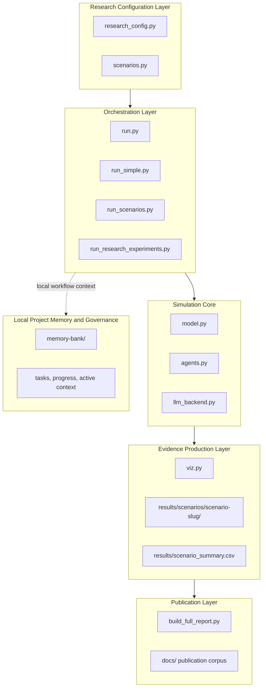
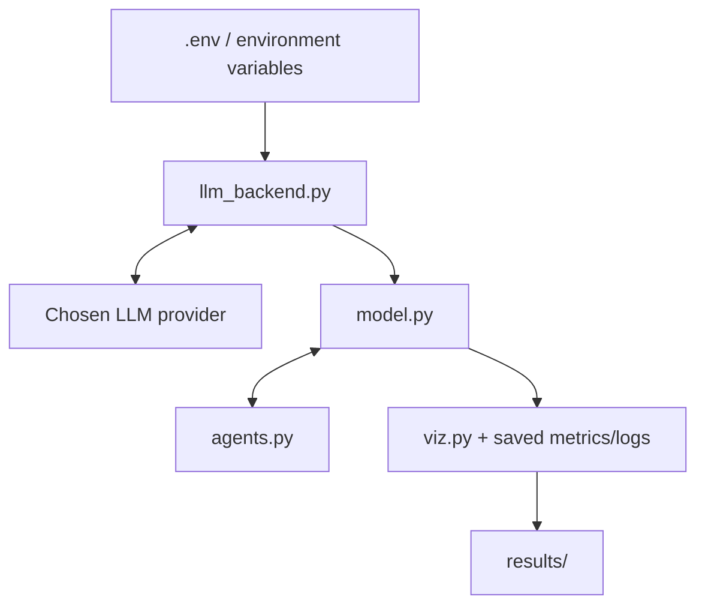
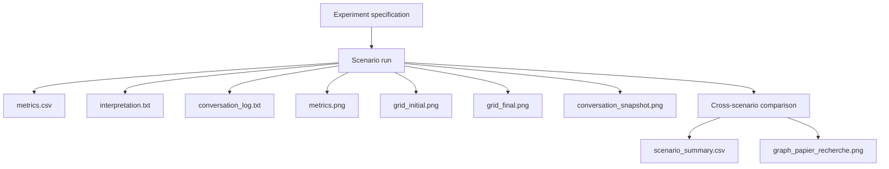
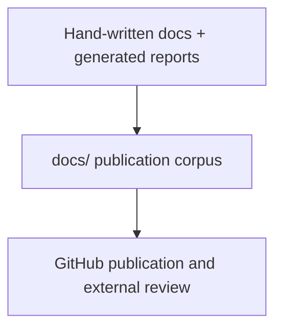

# Project Architecture

## 1. Purpose of the Architecture

This document presents the architecture of the entire project from the perspective of a research workflow. The repository is designed as a reproducible scientific pipeline in which simulation, interpretation, visualization, and publication are connected but clearly separated.

## 2. System-Level View



## 3. Architectural Principles

### 3.1 Separation of Concerns

The repository separates:

- scientific hypotheses and scenario definitions;
- agent-level simulation logic;
- provider-specific LLM access;
- figure and report generation;
- project memory and execution tracking.

### 3.2 Reproducibility

Generated artifacts are derived from source files and are intentionally excluded from version control. The repository is therefore designed to publish source, not ephemeral evidence bundles.

### 3.3 Interpretability

The architecture preserves a strong distinction between:

- explicit simulation logic implemented in Python;
- interpretive textual output generated by the LLM layer.

This distinction is central to methodological transparency.

## 4. Runtime Architecture

### 4.1 Main Runtime Paths

| Path | Objective | Typical entry point |
|---|---|---|
| Quick validation | Small-scale local run | `run_simple.py` |
| Standard simulation | Single scenario with charts | `run.py` |
| Scenario comparison | Multiple dilemmas on a shared runtime | `run_scenarios.py` |
| Full research campaign | Controlled structural experiments with artifact bundles | `run_research_experiments.py` |
| Interactive exploration | Browser-based inspection | `vis_server.py` |

### 4.2 Runtime Data Flow



## 5. Research Architecture

The research campaign is intentionally organized around scenario bundles.



This design makes each scenario auditable as an independent evidence package.

## 6. Documentation Architecture

### 6.1 Source Documents

The `docs/` folder now serves distinct documentation audiences:

- `Execution_Guide.md` for operational onboarding;
- `Maintenance_et_Lancement.md` for rerun and maintenance procedures;
- `ODD_Documentation.md` for the formal model description;
- `Code_Architecture.md` for code-level structure and function interactions;
- `Project_Architecture.md` for the global system view.

### 6.2 Publication Path



## 7. Provider-Agnostic LLM Architecture

The repository is designed so that future users can choose the provider that matches their institutional, financial, or methodological constraints.

### 7.1 Contract

The simulation code expects only:

- a model identifier;
- an API key;
- an optional provider label;
- an optional compatible base URL.

### 7.2 Encapsulation

All provider-facing logic is contained inside `llm_backend.py`. This reduces coupling and prevents the simulation core from becoming tied to a single vendor or SDK.

## 8. Repository Topology

```text
/
|- agents.py
|- model.py
|- llm_backend.py
|- research_config.py
|- run*.py
|- viz.py
|- build_full_report.py
|- docs/
|  |- Execution_Guide.md
|  |- Maintenance_et_Lancement.md
|  |- ODD_Documentation.md
|  |- Code_Architecture.md
|  |- Project_Architecture.md
|- memory-bank/
|  |- projectbrief.md
|  |- productContext.md
|  |- activeContext.md
|  |- systemPatterns.md
|  |- techContext.md
|  |- progress.md
|  |- tasks/
|- results/              generated locally, ignored by git
```

## 9. Why This Architecture Supports Research Quality

This structure is appropriate for research-oriented work because it supports:

- traceable scenario definitions;
- clear separation between model assumptions and narrative outputs;
- reproducible evidence generation;
- independent review of figures, logs, and reports;
- publication-ready documentation without polluting the repository with generated files.

## 10. Recommended Reading Order

For a new reader or evaluator, the recommended order is:

1. `README.md`
2. `docs/Project_Architecture.md`
3. `docs/Code_Architecture.md`
4. `docs/ODD_Documentation.md`
5. `docs/Execution_Guide.md`

This sequence moves from strategic understanding to implementation detail and finally to execution practice.
