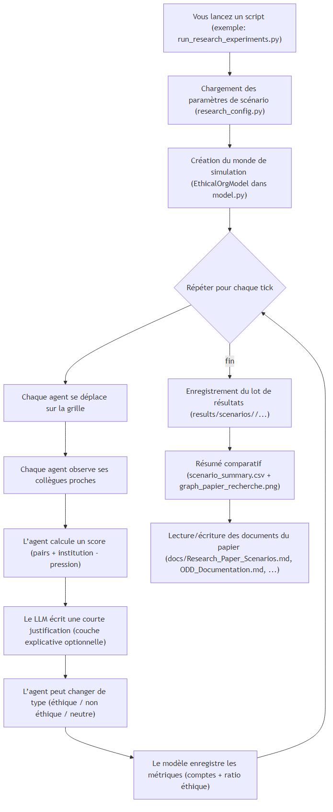
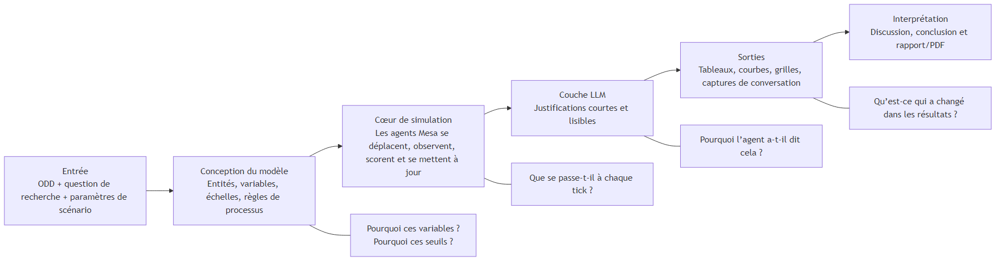
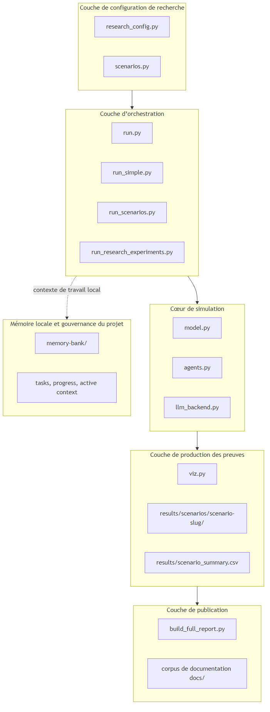
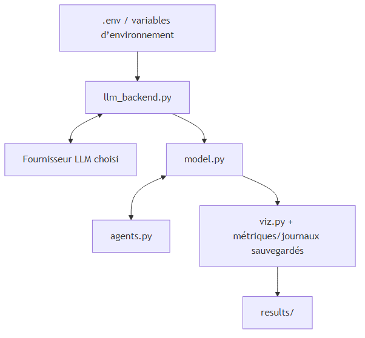
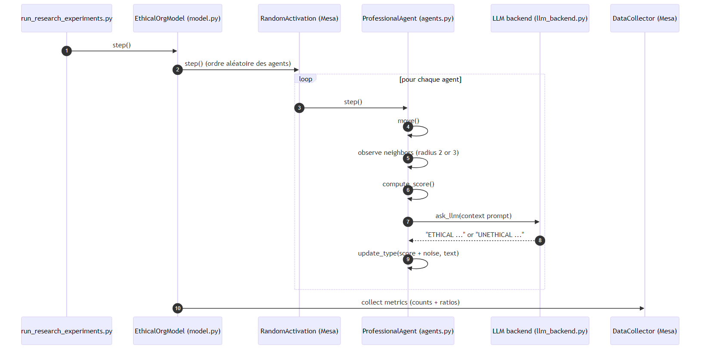
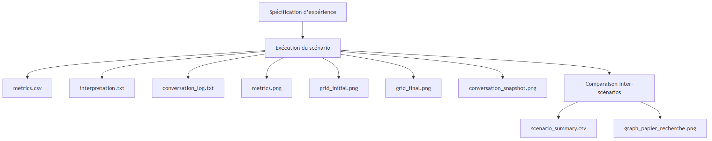
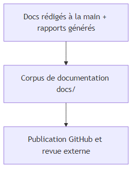

# Architecture du Projet

## 1. Objectif de l’architecture

Ce document présente l’architecture de l’ensemble du projet du point de vue d’un flux de recherche. Le dépôt est conçu comme un pipeline scientifique reproductible dans lequel la simulation, l’interprétation, la visualisation et la publication sont reliées, mais clairement séparées.

## 2. Vue d’ensemble du système

### 2.1 Pipeline en langage simple

Ce schéma répond à la question: **« Si je lance le projet une fois, que se passe-t-il du début à la fin ? »**


{ width=70% }


### 2.2 Pipeline de recherche: ODD -> Simulation -> LLM -> Résultats

C’est le flux de bout en bout le plus clair si l’on veut expliquer l’étude à quelqu’un hors du domaine:


{ width=85% }


En termes simples:
- `ODD` définit la structure du modèle et la signification des nombres.
- La simulation transforme ces règles en comportement d’agents dans le temps.
- Le `LLM` ne pilote pas le modèle; il explique le contexte local de décision en texte court.
- Les sorties sont ensuite agrégées en figures et tableaux pour l’article.

### 2.3 Vue technique du système (modules)


{ width=70% }


## 3. Principes architecturaux

### 3.1 Séparation des responsabilités

Le dépôt sépare:

- les hypothèses scientifiques et les définitions de scénarios;
- la logique de simulation au niveau agent;
- l’accès LLM spécifique au fournisseur;
- la génération des figures et des rapports;
- la mémoire du projet et le suivi d’exécution.

### 3.2 Reproductibilité

Les artefacts générés sont dérivés des fichiers source et sont volontairement exclus du contrôle de version. Le dépôt est donc conçu pour publier le code source, et non des artefacts éphémères.

### 3.3 Interprétabilité

L’architecture maintient une distinction nette entre:

- la logique de simulation explicite implémentée en Python;
- la sortie textuelle interprétative générée par la couche LLM.

Cette distinction est essentielle pour la transparence méthodologique.

## 4. Architecture d’exécution

### 4.1 Principaux chemins d’exécution

| Chemin | Objectif | Point d’entrée typique |
|---|---|---|
| Validation rapide | Exécution locale à petite échelle | `run_simple.py` |
| Simulation standard | Un scénario avec graphiques | `run.py` |
| Comparaison de scénarios | Plusieurs dilemmes sur une même exécution | `run_scenarios.py` |
| Campagne de recherche complète | Expériences structurelles contrôlées avec lots d’artefacts | `run_research_experiments.py` |
| Exploration interactive | Inspection via navigateur | `vis_server.py` |

### 4.2 Flux de données à l’exécution


{ width=70% }


### 4.3 Ce qui se passe à l’intérieur d’un tick


{ width=70% }


## 5. Architecture de recherche

La campagne de recherche est organisée autour de lots de scénarios.


{ width=70% }


Cette structure rend chaque scénario audit-able comme un lot de preuves indépendant.

## 6. Architecture de la documentation

### 6.1 Documents sources

Le dossier `docs/` sert maintenant plusieurs publics:

- `Execution_Guide.md` pour l’onboarding opérationnel;
- `Maintenance_et_Lancement.md` pour les procédures de relance et de maintenance;
- `ODD_Documentation.md` pour la description formelle du modèle;
- `Code_Architecture.md` pour la structure au niveau code et les interactions entre fonctions;
- `Project_Architecture.md` pour la vue globale du système.

### 6.2 Chemin de publication


{ width=70% }


## 7. Architecture LLM agnostique au fournisseur

Le dépôt est conçu pour que les utilisateurs futurs puissent choisir le fournisseur qui correspond à leurs contraintes institutionnelles, financières ou méthodologiques.

### 7.1 Contrat

Le code de simulation attend seulement:

- un identifiant de modèle;
- une clé API;
- un libellé de fournisseur optionnel;
- une base URL compatible optionnelle.

### 7.2 Encapsulation

Toute la logique côté fournisseur est contenue dans `llm_backend.py`. Cela réduit le couplage et empêche le noyau de simulation de dépendre d’un SDK ou d’un fournisseur unique.

## 8. Topologie du dépôt

```text
/
|- agents.py
|- model.py
|- llm_backend.py
|- research_config.py
|- run*.py
|- viz.py
|- build_full_report.py
|- docs/
|  |- Execution_Guide.md
|  |- Maintenance_et_Lancement.md
|  |- ODD_Documentation.md
|  |- Code_Architecture.md
|  |- Project_Architecture.md
|- memory-bank/
|  |- projectbrief.md
|  |- productContext.md
|  |- activeContext.md
|  |- systemPatterns.md
|  |- techContext.md
|  |- progress.md
|  |- tasks/
|- results/              généré localement, ignoré par git
```

## 9. Pourquoi cette architecture soutient la qualité scientifique

Cette structure est adaptée à un travail orienté recherche parce qu’elle soutient:

- des définitions de scénarios traçables;
- une séparation claire entre les hypothèses du modèle et les sorties narratives;
- une génération reproductible des preuves;
- une revue indépendante des figures, journaux et rapports;
- une documentation prête à publier sans polluer le dépôt avec des fichiers générés.

## 10. Ordre de lecture recommandé

Pour un nouveau lecteur ou évaluateur, l’ordre recommandé est:

1. `README.md`
2. `docs/Project_Architecture.md`
3. `docs/Code_Architecture.md`
4. `docs/ODD_Documentation.md`
5. `docs/Execution_Guide.md`

Cette séquence va de la compréhension stratégique au détail d’implémentation, puis à la pratique d’exécution.

